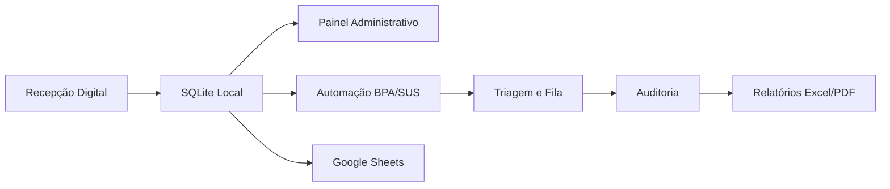

# HMPCF Automation System

Sistema de automação hospitalar desenvolvido para otimizar processos
operacionais, recepção, integração BPA/SUS, auditoria e fluxos
administrativos em ambiente hospitalar real.

---

## Visão Geral

O HMPCF Automation System integra recepção digital, automação BPA/SUS,
painel de gestão, auditoria e sincronização com Google Sheets, reduzindo
retrabalho manual e eliminando fichas em papel no Hospital Municipal
Pres. Café Filho (Extremoz/RN).

---

## Funcionalidades

- **Recepção Digital** — Cadastro de pacientes, busca por CPF/SUS/nome,
  validação de dados e registro de atendimentos
- **Automação BPA/SUS** — Geração de lotes, exportação TXT posicional e
  digitação automática (RPA)
- **Painel de Gestão** — Indicadores, integração Firebird, consulta de
  atendimentos, backup e exportação de relatórios
- **Auditoria** — Verificação de inconsistências, rastreabilidade e
  log centralizado de operações
- **Sincronização** — Envio automático de atendimentos para Google Sheets
  ("Gari da Nuvem")

---

## Interface

### Recepção

> 📸 *Captura de tela da interface de Recepção — disponível em breve.*

### Painel Administrativo

> 📸 *Captura de tela do Painel Administrativo — disponível em breve.*

### Automação e Auditoria

> 📸 *Captura de tela do módulo de Automação e Auditoria — disponível em breve.*

---

## Arquitetura



```text
📦 HMPCF-Automation-System
 ┣ 📂 analise/            # Dashboards e relatórios
 ┣ 📂 automacao/          # RPA e digitação
 ┣ 📂 integracao/         # BPA/SUS — conversores e sincronizadores
 ┣ 📂 scripts/            # Ferramentas administrativas
 ┣ 📂 web_recepcao/       # Frontend da Recepção (porta 8000)
 ┣ 📂 web_painel/         # Frontend do Painel (porta 8001)
 ┣ 📂 screenshots/        # Capturas do sistema
 ┣ 📜 app_recepcao.py     # Servidor da Recepção
 ┣ 📜 app_painel.py       # Servidor do Painel
 ┣ 📜 main.py             # Launcher unificado
 ┣ 📜 config.py           # Configuração centralizada
 ┣ 📜 planilha_nuvem.py   # Sincronizador Google Sheets
 ┣ 📜 utils.py            # Validações (CPF, CNS)
 ┗ 📜 .env.example        # Template de configuração
```

---

## Stack

| Camada | Tecnologia |
|---|---|
| Backend | Python, Eel |
| Frontend | HTML, CSS, JavaScript |
| Banco | SQLite, Firebird |
| Automação | PyAutoGUI |
| Nuvem | Google Sheets API |
| Relatórios | Excel (openpyxl), PDF (fpdf2) |

---

## Instalação

```bash
git clone https://github.com/fabiogomes95/HMPCF-Automation-System
cd HMPCF-Automation-System
pip install -r requirements.txt
cp .env.example .env  # configure suas credenciais
```

## Execução

```bash
python main.py           # Recepção + Painel
python app_recepcao.py   # Apenas Recepção (porta 8000)
python app_painel.py     # Apenas Painel (porta 8001)
```

---

## Licença

Copyright (c) 2026 Fabio Gomes. Todos os direitos reservados.

Disponível publicamente para fins de estudo, demonstração técnica e
portfólio. Não é permitido uso comercial, institucional ou implantação
em produção sem autorização explícita do autor.
