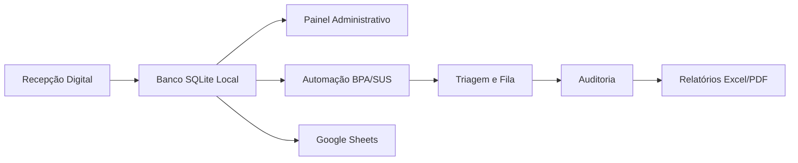

# HMPCF Automation System

Sistema de automação hospitalar desenvolvido para otimizar processos operacionais, recepção, integração BPA/SUS, auditoria e fluxos administrativos em ambiente hospitalar real.

---

## Status

Projeto em operação e evolução contínua.

---

# Visão Geral

O HMPCF Automation System surgiu da necessidade de reduzir retrabalho operacional, automatizar processos repetitivos e melhorar o fluxo administrativo hospitalar.

O sistema integra:
- automações BPA/SUS;
- recepção digital;
- auditoria;
- sincronização;
- painéis administrativos;
- validações;
- integração com sistemas legados.

O projeto foi desenvolvido com foco em:
- produtividade;
- redução de erros;
- automação operacional;
- fluxo hospitalar real.

---

# Impacto Operacional

- Redução significativa de retrabalho manual na recepção
- Automatização de processos BPA/SUS
- Eliminação parcial de fichas em papel
- Integração digital entre setores
- Geração automatizada de lotes
- Redução de inconsistências operacionais
- Auditoria facilitada
- Centralização de informações administrativas
- Sincronização automática de dados
- Sistema utilizado em ambiente hospitalar real

---

# Problemas Resolvidos

## Antes do sistema
- Processos manuais repetitivos
- Uso excessivo de papel
- Retrabalho operacional
- Lançamentos BPA manuais
- Falta de auditoria centralizada
- Dificuldade de sincronização
- Perda de produtividade
- Alto risco de erro humano

## Após automação
- Fluxo digital integrado
- Automação operacional
- Painéis administrativos
- Processamento automatizado
- Auditoria facilitada
- Validação de dados
- Redução de erros
- Melhor rastreabilidade operacional

---

# Casos de Uso

- Recepção hospitalar
- Automação BPA/SUS
- Auditoria operacional
- Processamento de lotes
- Triagem administrativa
- Digitalização de fluxo interno
- Integração entre setores
- Geração automatizada de relatórios
- Sincronização operacional

---

# Interface

## Recepção


---

## Painel Administrativo


---

## Automação e Auditoria


---

# Fluxo Arquitetural



---

# Arquitetura do Projeto

```text
📦 HMPCF-Automation-System
 ┣ 📂 analise/                 # BI — Dashboards, relatórios Excel e PDF
 ┣ 📂 automacao/               # RPA — Robô digitador, triagem e fila de lotes
 ┣ 📂 integracao/              # Integração SUS — conversores TXT e sincronizadores
 ┣ 📂 scripts/                 # Scripts administrativos e manutenção operacional
 ┣ 📂 web_recepcao/            # Frontend da Recepção (Eel)
 ┣ 📂 web_painel/              # Frontend do Painel de Gestão (Eel)
 ┣ 📂 assets/                  # Recursos estáticos (ícones)
 ┣ 📂 screenshots/             # Capturas do sistema
 ┣ 📜 app_recepcao.py          # Servidor da Recepção (Eel — porta 8000)
 ┣ 📜 app_painel.py            # Servidor do Painel de Gestão (Eel — porta 8001)
 ┣ 📜 main.py                  # Launcher unificado
 ┣ 📜 config.py                # Configuração centralizada
 ┣ 📜 planilha_nuvem.py        # "Gari da Nuvem" — sincronizador Google Sheets
 ┣ 📜 utils.py                 # Motor de validações (CPF, CNS e regex)
 ┣ 📜 pyproject.toml           # Estrutura do pacote Python
 ┣ 📜 .env.example             # Template de configuração
 ┣ 📜 local_database.db        # Banco SQLite local para contingência operacional
 ┣ 📜 google_credentials.example.json # Template de credenciais Google Cloud
 ┣ 📜 requirements.txt         # Dependências do projeto
 ┣ 📜 backlog.md               # Pendências e ideias futuras
 ┣ 📜 CHANGELOG.md             # Histórico de alterações
 ┣ 📜 start_painel.vbs         # Inicializador silencioso — Painel
 ┣ 📜 start_recepcao.vbs       # Inicializador silencioso — Recepção
 ┣ 📜 iniciar_painel.bat       # Inicializador Painel (porta 8001)
 ┗ 📜 iniciar_recepcao.bat     # Inicializador Recepção (porta 8000)
```

---

# Principais Funcionalidades

## Recepção Digital
- Cadastro e gerenciamento de pacientes
- Fluxo digital integrado
- Validação de dados
- Controle operacional

## Automação BPA/SUS
- Processamento automatizado
- Geração de lotes
- Integração operacional
- Exportações automatizadas

## Auditoria
- Verificação de inconsistências
- Controle operacional
- Rastreabilidade
- Análise de dados

## Painel Administrativo
- Visualização operacional
- Controle administrativo
- Monitoramento de fluxo
- Indicadores internos

## Sincronização
- Integração entre setores
- Atualização automática
- Controle de contingência

---

# Stack Técnica

## Backend
- Python
- SQLite
- Firebird
- Eel

## Automação
- PyAutoGUI
- Automação BPA/SUS
- Processamento de lotes
- Integração TXT

## Frontend
- HTML
- CSS
- JavaScript

## Integrações
- Google Sheets API
- Conversores SUS
- Sincronização operacional

## Relatórios
- Excel
- PDF
- Dashboards operacionais

---

# Destaques Técnicos

- Arquitetura modular baseada em domínio operacional
- Separação entre recepção, painel e automação
- Integração com fluxo SUS/BPA
- Processamento automatizado de lotes
- Sistema híbrido Desktop/Web com Eel
- Validações centralizadas (CPF, CNS e regex)
- Sincronização operacional com Google Sheets
- Estrutura preparada para expansão futura

---

# Tecnologias Utilizadas

## Backend
- Python

## Frontend
- HTML
- CSS
- JavaScript

## Automação
- PyAutoGUI
- Scripts de integração

## Banco de Dados
- SQLite
- Firebird (integração)

## Interface Desktop/Web
- Eel

---

# Objetivos Técnicos

- Automatizar processos hospitalares
- Reduzir erros operacionais
- Melhorar produtividade
- Facilitar auditoria
- Digitalizar fluxos administrativos
- Integrar setores
- Minimizar retrabalho

---

# Diferenciais

- Desenvolvido com base em problemas reais
- Fluxo hospitalar real
- Integração SUS/BPA
- Automação operacional prática
- Sistema modular
- Painel administrativo integrado
- Auditoria operacional
- Sincronização de dados
- Contingência operacional

---

# Roadmap Futuro

- Migração gradual para FastAPI
- PostgreSQL
- APIs REST
- Dashboard avançado
- Logs estruturados
- Melhorias de segurança
- Deploy profissional
- Docker
- Multiusuário
- Observabilidade
- OCR e automação avançada

---

# Instalação

```bash
git clone https://github.com/fabiogomes95/HMPCF-Automation-System
```

---

# Execução

## Recepção

```bash
python app_recepcao.py
```

## Painel Administrativo

```bash
python app_painel.py
```

## Inicializador Unificado

```bash
python main.py
```

---

# Observações

Projeto desenvolvido com base em necessidades operacionais reais de ambiente hospitalar, com foco em automação, integração e digitalização de processos administrativos.

O desenvolvimento contou com apoio de ferramentas de IA generativa para assistência técnica, refatoração e aceleração de desenvolvimento.

---

# Licença

Copyright (c) 2026 Fabio Gomes

Este projeto está disponível publicamente apenas para fins de:
- estudo;
- demonstração técnica;
- portfólio;
- avaliação educacional.

Não é permitida:
- redistribuição comercial;
- revenda;
- uso institucional;
- implantação em produção;
- modificação para fins comerciais;

sem autorização explícita do autor.

Todos os direitos reservados.
