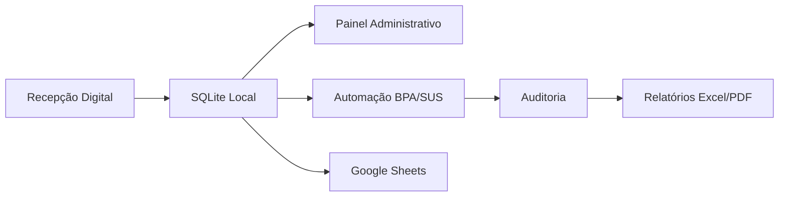

# HMPCF Automation System


> Hospital automation system for patient check-in, SUS/BPA billing,
> administrative management and audit. Built for a real hospital in
> Extremoz/RN, Brazil.

Sistema de automação hospitalar desenvolvido para otimizar processos
operacionais, recepção, integração BPA/SUS, auditoria e fluxos
administrativos em ambiente hospitalar real.

---

## Visão Geral

O HMPCF Automation System integra recepção digital, automação BPA/SUS,
painel de gestão, auditoria e sincronização com Google Sheets, reduzindo
retrabalho manual e eliminando fichas em papel no Hospital Municipal
Pres. Café Filho (Extremoz/RN).

### Problema

Antes do sistema, a recepção usava fichas de papel, os lançamentos BPA
eram feitos manualmente um a um, a auditoria era feita em planilhas
soltas e não havia sincronização entre os setores.

### Solução

Um sistema integrado que digitaliza o fluxo da recepção, automatiza a
geração de lotes BPA/SUS, centraliza a auditoria e sincroniza os dados
com a nuvem — tudo acessível via navegador nas estações do hospital.

---

## Funcionalidades

- **Recepção Digital** — Cadastro de pacientes com busca por CPF, SUS ou
  nome, validação automática de CPF e CNS, registro de atendimentos
- **Automação BPA/SUS** — Geração de arquivos TXT posicionais, exportação
  de lotes e digitação automática via RPA (PyAutoGUI)
- **Painel de Gestão** — Indicadores em tempo real, integração com
  Firebird (sistema legado), consulta de atendimentos paginada,
  backup automático e exportação de relatórios Excel/PDF
- **Auditoria** — Verificação de inconsistências, log centralizado de
  operações e rastreabilidade completa
- **Sincronização** — "Gari da Nuvem": envio automático de atendimentos
  para Google Sheets a cada 10 segundos

---

## Arquitetura



```text
📦 HMPCF-Automation-System
 ┣ 📂 analise/                 # BI — Dashboards, relatórios Excel e PDF
 ┣ 📂 automacao/               # RPA — Robô digitador, triagem e fila de lotes
 ┣ 📂 integracao/              # Integração SUS — conversores TXT e sincronizadores
 ┣ 📂 scripts/                 # Scripts administrativos e manutenção operacional
 ┣ 📂 web_recepcao/            # Frontend da Recepção (Eel, porta 8000)
 ┣ 📂 web_painel/              # Frontend do Painel de Gestão (Eel, porta 8001)
 ┣ 📂 screenshots/             # Capturas do sistema
 ┣ 📜 app_recepcao.py          # Servidor da Recepção (Eel — porta 8000)
 ┣ 📜 app_painel.py            # Servidor do Painel de Gestão (Eel — porta 8001)
 ┣ 📜 main.py                  # Launcher unificado
 ┣ 📜 config.py                # Configuração centralizada
 ┣ 📜 planilha_nuvem.py        # "Gari da Nuvem" — sincronizador Google Sheets
 ┣ 📜 utils.py                 # Motor de validações (CPF, CNS e regex)
 ┣ 📜 pyproject.toml           # Estrutura do pacote Python
 ┣ 📜 .env.example             # Template de configuração
 ┣ 📜 hospital.db              # Banco SQLite local (não versionado)
 ┣ 📜 credentials.json         # Chave de serviço Google Cloud (não versionado)
 ┣ 📜 requirements.txt         # Dependências do projeto
 ┣ 📜 backlog.md               # Pendências e ideias futuras
 ┣ 📜 CHANGELOG.md             # Histórico de alterações
 ┣ 📜 start_painel.vbs         # Inicializador silencioso — Painel
 ┣ 📜 start_recepcao.vbs       # Inicializador silencioso — Recepção
 ┣ 📜 iniciar_painel.bat       # Inicializador Painel (porta 8001)
 ┗ 📜 iniciar_recepcao.bat     # Inicializador Recepção (porta 8000)
```

---

Desenvolvido por [Fabio Gomes](https://www.linkedin.com/in/fabiogsilva95/)

## Licença

Copyright (c) 2026 Fabio Gomes. Todos os direitos reservados.

Disponível publicamente para fins de estudo, demonstração técnica e
portfólio. Não é permitido uso comercial, institucional ou implantação
em produção sem autorização explícita do autor.
